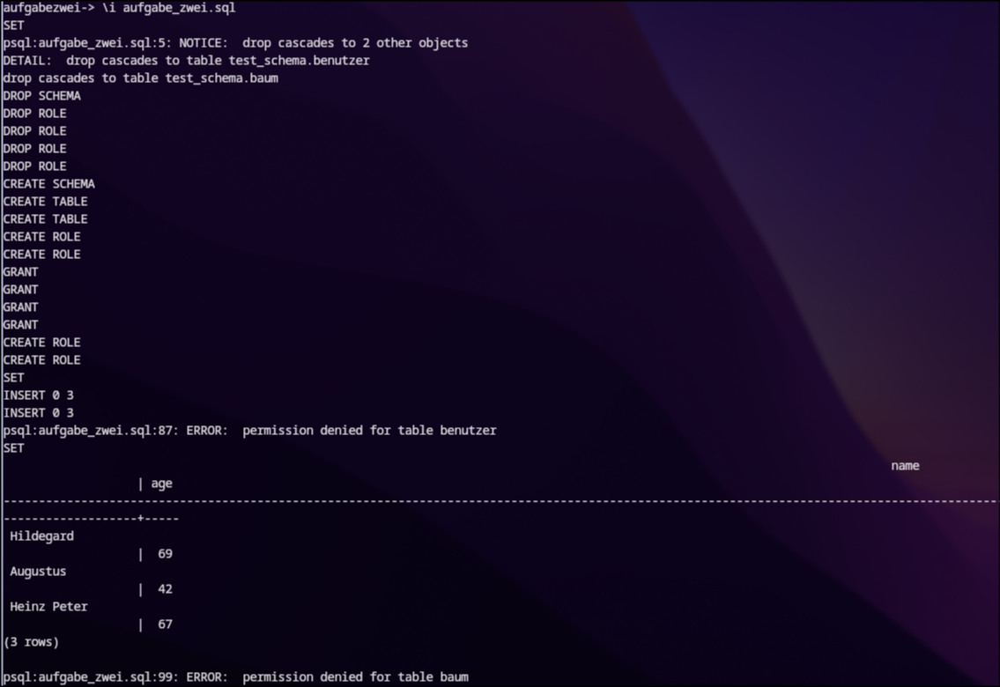

# PostgreSQL Schema und Rollenaufgabe

  

## Schema anlegen

  

```SQL
CREATE SCHEMA test_schema;
```

  

## Tabellen im Schema anlegen

  

```SQL
CREATE TABLE test_schema.benutzer(
	name CHARACTER (255),
	age INT
);

CREATE TABLE test_schema.baum(
	age INT,
	height INT
);
```

  

## Rollen definieren

  

```SQL
CREATE ROLE writer;

CREATE ROLE reader;
```

  

## Berechtigungen für die Rollen im Schema auf die Tabellen verbergen

  

```SQL
-- Writer  

GRANT USAGE
ON SCHEMA test_schema
TO writer;

GRANT INSERT, UPDATE, DELETE
ON test_schema.benutzer, test_schema.baum
TO writer;  

-- Reader

GRANT USAGE
ON SCHEMA test_schema
TO reader;

GRANT SELECT
ON test_schema.benutzer, test_schema.baum
TO reader;
```

  

## Benutzer anlegen und den Rollen zuweisen

  

```SQL
CREATE USER write_user IN GROUP writer;

CREATE USER read_user IN GROUP reader;
```

  

## Testen der User

### Testen des Schreib-User

Writer anmelden
```SQL
SET ROLE write_user;
```

Writer sollte dies können  
```SQL
INSERT INTO test_schema.benutzer VALUES
('Hildegard', 69),
('Augustus', 42),
('Heinz Peter', 67);

INSERT INTO test_schema.baum VALUES
(300, 40),
(3, 1),
(42, 52);
```

Writer darf diesen Befehl nicht ausführen
```SQL
SELECT * FROM test_schema.benutzer;
```

### Testen des Lese-User

Reader Anmelden
```SQL
SET ROLE read_user;
```

Reader sollte dies können
```SQL
SELECT * FROM test_schema.benutzer;
```

Reader darf diesen Befehl nicht ausführen
```SQL
INSERT INTO test_schema.baum VALUES (3, 5);
```


## Validitätsnachweis


