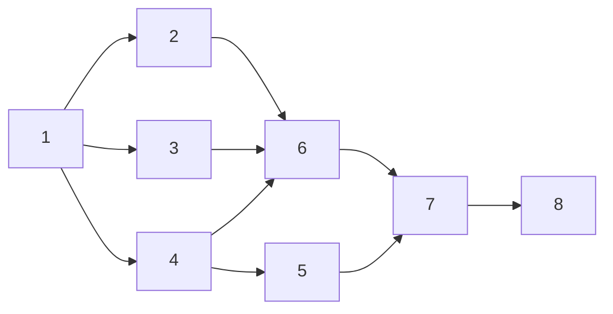

# Netzplantechnik
* Grundlage
* Berechnungen
* welche Vorgänge in welcher Reihenfolge (Vorgänge, die aneinander geknüpft werden)

| Nr. | Vorgänger | Dauer in Tagen | Bezeichung           |
| --- | --------- | -------------- | -------------------- |
| 1   |           | 3              | <füll ich nicht aus> |
| 2   | 1         | 10             | ...                  |
| 3   | 1         | 7              |                      |
| 4   | 1         | 2              |                      |
| 5   | 4         | 8              |                      |
| 6   | 2,3,4     | 10             |                      |
| 7   | 5,6       | 5              |                      |
| 8   | 7         | 2              |                      |

Aus der Tabelle soll ein Netzplan werden. Die Knoten schauen so aus (Normalfolge -> Ende-Anfang EA):

## Vorwärtsrechnung

Zeigt wann das Projekt endet wenn alles ohne Verzögerung abläuft.
FEZ = FAZ + Dauer

Bei unserem Beispiel: FEZ = 3+ 10 + 10 +5 + 2 = 30 (FAZ = 0 weil kein Projekt davor ist)

| NR (Vorgangsnummer)          |                    | D (Vorgangsdauer)            |
| ---------------------------- | ------------------ | ---------------------------- |
| FAZ (Frühester Anfangspunkt) | GP (Gesamtpuffer)  | FEZ (Frühester Endzeitpunkt) |
| SAZ (Spätester Anfangspunkt) | FP (Freier Puffer) | SEZ (Spätester Endzeitpunkt) |

Aus der gegebenen Tabelle ergeben sich diese 8 Knoten

### Vorgang 1

| Nr. 1                        |                    | 3                            |
| ---------------------------- | ------------------ | ---------------------------- |
| 0                            | GP (Gesamtpuffer)  | 3                            |
| SAZ (Spätester Anfangspunkt) | FP (Freier Puffer) | SEZ (Spätester Endzeitpunkt) |

## Rückwärtsrechung

## Pufferzeiten berechnung

## kritischen Pfad hervorheben

# Gantt-Chart