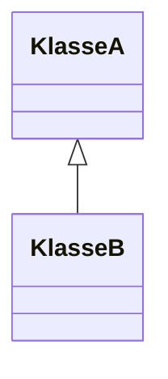

Dependency = Abhängigkeit
Was ist eine Abhängigkeit?
Klasse A hat eine Abhängigkeit zu Klasse B wenn es in irgendeiner Form mit dieser interagiert.



z.B. Klasse A instanziert Klasse B selbst: 
```Java
public class A {
	private B bDependency;
	public A() {
		bDependency = new B();
	}
}
```

Oder man injiziert eine Instanz der Klasse B in A (Dependency Injection)
```Java
public class A {
	private B b;
	public A(B bDependency) {
		b = bDependency; 
	}
}
```

## 3 Arten der Dependency Injection

* Mittels Konstruktor (Beispiel oben)
* Mittels Setter
* Mittels Eigenschaften (z.B. mit Annotierungen, z.B. `@Autowired` in Spring)

## Vorteile von Dependency Injection

* Trennen von Zuständigkeiten
* Ein lose gekoppeltes System
* Sehr hilfreich beim Testen (Test-Mockups werden injiziert)