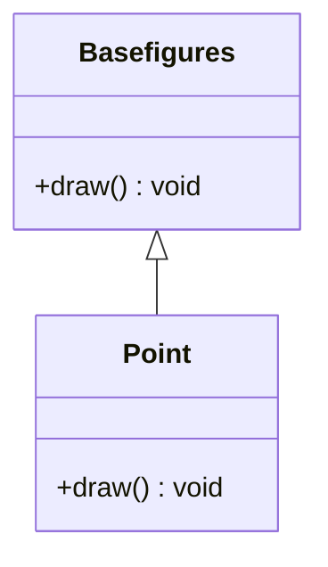

Problem: was macht `draw()` bei nicht konkreten Figur.

Man könnte eine leere Methode einfügen dies führt zu der Problematik, dass die Klasse instanziierbar ist, obwohl es nicht sinnvoll ist da die geometrische Form nicht festgelegt ist. Genau für solche Fälle eigenen sich abstrakte Basisklassen. Diese erlauben es, Methoden vorzugeben die von Subklassen zu implementieren sin.